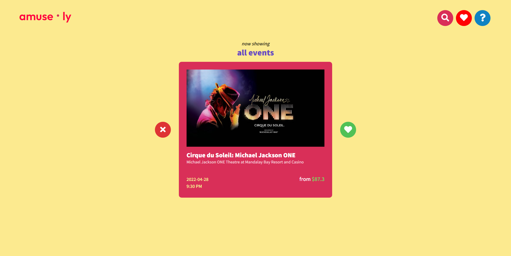
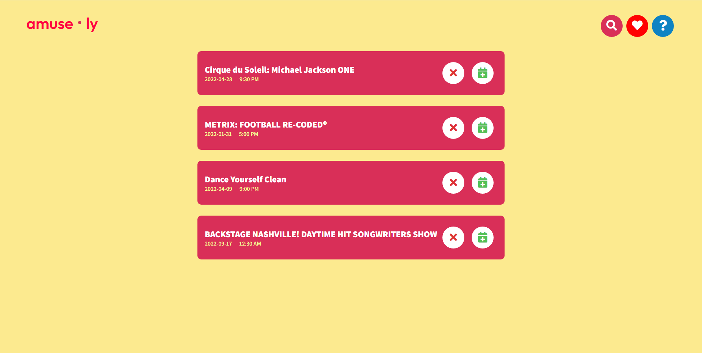

# amusely
amusely is an app that allows you to search for and browse through upcoming events in a city. Powered by the [TicketMaster Discovery API](https://developer.ticketmaster.com/products-and-docs/apis/discovery-api/v2/). 

Live site: https://amusely.netlify.app/

## Problem Statement and End User
This app was designed for those who are overburdened by the multitude of events going on. Browsing and searching for events can be a tedious task. This app simplifies the process. Anyone looking for new events to attend in their city (or any city) would benefit from using this web app.

## Features
- Search for events 
  - Allows you to enter a keyword, city, and dates
- Add events to your saved events
- Add events to your Google Calendar 

## Screenshots
home page

events page

## Built with
- [TicketMaster Discovery API](https://developer.ticketmaster.com/products-and-docs/apis/discovery-api/v2/)
- [Google Calendar API](https://developers.google.com/calendar/api)
- [ReactJS](https://reactjs.org/) 

## Future Development Goals
- User sign in/sign up
  - save user event list to a database
- More responsiveness/animations
- Better mobile integration 

## Author
Github: [@VivianLi1](https://github.com/VivianLi1)

LinkedIn: [Vivian Li](https://www.linkedin.com/in/vivian-li-39188b171/)
